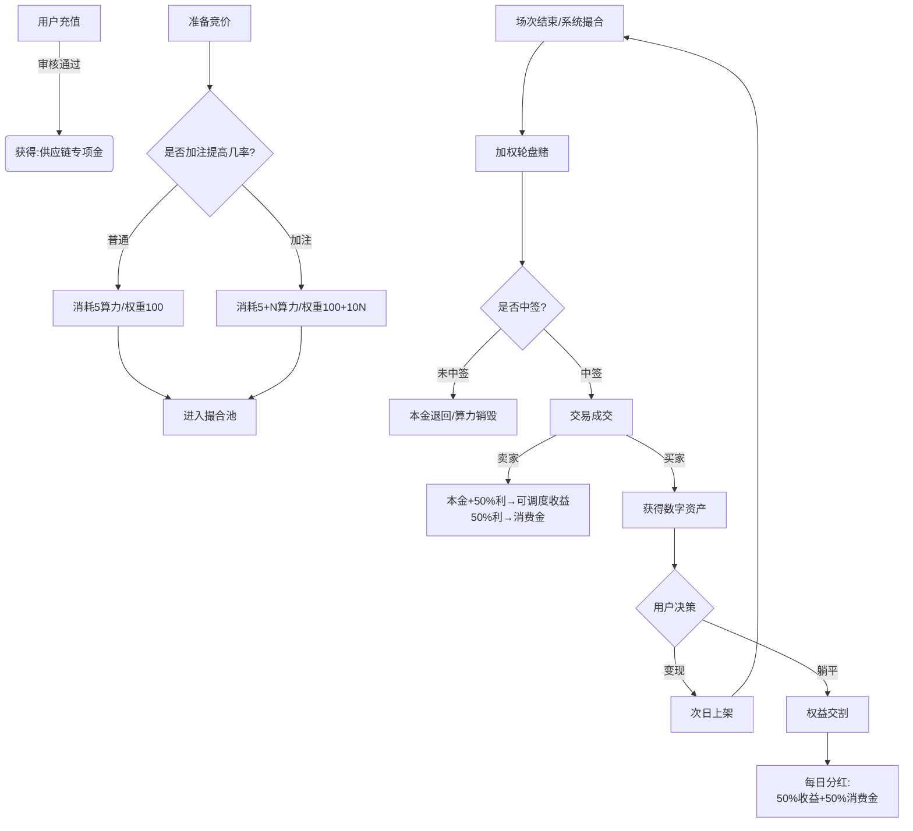

# 树交所（TreeEx）后端核心业务逻辑开发文档（最终整合版）

**文档版本：** v9.0 Final  
**更新日期：** 2025-12-12  
**适用技术栈：** PHP (ThinkPHP/Laravel) + MySQL 5.7+ + Redis  
**核心架构：** 预约撮合引擎 + 算力加注机制 + 资金四库隔离 + 权益分红兜底 + 旧资产解锁

---

## 📋 目录

1. [数据库设计](#一数据库设计)
2. [核心业务模块](#二核心业务模块)
3. [算力经济模型](#三算力经济模型)
4. [资金流转闭环](#四资金流转闭环)
5. [旧资产解锁机制](#五旧资产解锁机制)
6. [定时任务](#六定时任务)
7. [开发注意事项](#七开发注意事项)

---

## 一、数据库设计

### 1.1 用户资产表（users）- 字段业务重定义

**重要：** 无需修改物理字段名，仅修改代码业务逻辑映射

```sql
-- 字段业务含义映射：
-- available_money  → 【供应链专项金】（只进不出，用于抢购冻结，来源：充值）
-- withdraw_money   → 【可调度收益】（可提现，来源：卖货回款/佣金）
-- service_money    → 【确权金】（手续费，来源：划转）
-- score            → 【消费金】（内循环通证，来源：交易利润分成）
-- （新增）legacy_frozen → 【待激活确权金】（旧账冻结金，用于兑换解锁包）

-- 新增字段
ALTER TABLE users 
ADD COLUMN green_hashrate DECIMAL(10,2) DEFAULT 0.00 COMMENT '绿色算力（抢购门票）',
ADD COLUMN legacy_frozen DECIMAL(10,2) DEFAULT 0.00 COMMENT '待激活确权金（旧资产抵扣额度）';
```

### 1.2 预约/申购记录表（trade_reservations）- 核心新增

```sql
CREATE TABLE `trade_reservations` (
  `id` int(11) NOT NULL AUTO_INCREMENT,
  `user_id` int(11) NOT NULL,
  `session_id` int(11) NOT NULL COMMENT '场次ID（早/午/晚场）',
  `product_id` int(11) DEFAULT '0' COMMENT '指定商品ID（可为0表示随机分配）',
  
  -- 资金冻结
  `freeze_amount` decimal(10,2) NOT NULL COMMENT '冻结【供应链专项金】金额',
  
  -- 算力与权重字段（加注机制核心）
  `base_hashrate_cost` decimal(10,2) NOT NULL COMMENT '基础消耗算力（门票成本）',
  `extra_hashrate_cost` decimal(10,2) DEFAULT '0.00' COMMENT '额外加注算力（Boost）',
  `weight` int(11) NOT NULL DEFAULT '100' COMMENT '中签权重（基数100，加注提升）',
  
  -- 状态
  `status` tinyint(1) DEFAULT '0' COMMENT '0:待匹配 1:中签 2:未中签',
  `create_time` int(11) DEFAULT NULL,
  `match_time` int(11) DEFAULT NULL COMMENT '撮合完成时间',
  
  PRIMARY KEY (`id`),
  KEY `idx_session_status` (`session_id`, `status`),
  KEY `idx_user` (`user_id`)
) ENGINE=InnoDB DEFAULT CHARSET=utf8mb4 COMMENT='竞价摘牌预约表';
```

### 1.3 用户持仓表（user_collection）- 字段扩展

```sql
ALTER TABLE user_collection 
ADD COLUMN is_legacy_unlock TINYINT(1) DEFAULT 0 COMMENT '是否为旧资产解锁包（1:是 0:否）',
ADD COLUMN lock_reason VARCHAR(50) DEFAULT '' COMMENT '锁定原因（如 MANUAL_STAKE）';

-- 状态说明：
-- 1: 持仓待售
-- 2: 挂单中
-- 3: 已卖出
-- 4: 已转分红（权益交割）
```

### 1.4 商品表（market_products）- 防伪字段

```sql
ALTER TABLE market_products 
ADD COLUMN asset_code VARCHAR(50) NOT NULL DEFAULT '' COMMENT '确权编号（37-DATA-YYYYMMDD-xxxxxx）',
ADD COLUMN tx_hash VARCHAR(64) NOT NULL DEFAULT '' COMMENT '存证指纹（MD5伪Hash）';
```

### 1.5 分红权益节点表（user_dividend_nodes）- 新建

```sql
CREATE TABLE `user_dividend_nodes` (
  `id` int(11) NOT NULL AUTO_INCREMENT,
  `user_id` int(11) NOT NULL,
  `origin_asset_id` int(11) NOT NULL COMMENT '原资产ID（来源）',
  `asset_name` varchar(255) DEFAULT NULL COMMENT '资产名称快照',
  
  -- 分红基数与配置快照
  `base_amount` decimal(10,2) NOT NULL COMMENT '分红基数（锁定时的资产价值）',
  `dividend_rate` decimal(10,4) NOT NULL DEFAULT '0.0050' COMMENT '日利率快照（如0.5%）',
  `total_days` int(11) NOT NULL DEFAULT '365' COMMENT '分红周期天数快照',
  
  -- 时间周期
  `start_time` int(11) NOT NULL COMMENT '收益开始时间（明天凌晨）',
  `end_time` int(11) NOT NULL COMMENT '收益截止时间',
  
  -- 统计
  `total_profit` decimal(10,2) DEFAULT '0.00' COMMENT '累计已产出收益',
  `status` tinyint(1) DEFAULT '1' COMMENT '1:生效中 2:已到期',
  
  `create_time` int(11) DEFAULT NULL,
  PRIMARY KEY (`id`),
  KEY `idx_user_status` (`user_id`, `status`)
) ENGINE=InnoDB DEFAULT CHARSET=utf8mb4 COMMENT='权益分红节点表';
```

### 1.6 系统配置表 - 参数说明

```json
{
  "rush_base_cost": 5,              // 基础门票消耗（绿色算力）
  "rush_boost_enable": 1,           // 是否开启加注功能（1:是 0:否）
  "rush_boost_max": 50,             // 单次最大加注上限（防止垄断）
  "rush_boost_ratio": 10,           // 加注汇率：每1点算力增加X权重
  
  "dividend_daily_rate": 0.005,     // 分红日化比例（0.5%）
  "dividend_period_days": 365,      // 分红有效期（天）
  
  "exchange_rate": 2,               // 兑换比例：N消费金=1算力
  
  "consign_fee_rate": 0.03,         // 寄售手续费率（3%）
  "legacy_unlock_cost": 1000        // 旧资产解锁消耗（旧账）
}
```

---

## 二、核心业务模块

### 模块一：商品上架与数据防伪

#### 2.1.1 Hash生成辅助函数

```php
/**
 * 生成存证指纹（MD5伪Hash）
 */
function generateAssetHash($productId) {
    $salt = env('ASSET_SALT', 'TREE_SECURE_2025');
    $timestamp = time();
    return md5($productId . $timestamp . $salt);
}

/**
 * 生成确权编号（37开头）
 */
function generateAssetCode($productId) {
    return '37-DATA-' . date('Ymd') . '-' . str_pad($productId, 6, '0', STR_PAD_LEFT);
}
```

#### 2.1.2 官方商品发布

```php
/**
 * 平台发布一级市场资产包
 */
public function publishProduct($data) {
    $productId = Db::name('market_products')->insertGetId([
        'name' => $data['name'],
        'price' => $data['price'],
        'session_id' => $data['session_id'],
        'status' => 1,
        'create_time' => time()
    ]);
    
    if ($productId) {
        // 生成防伪数据
        Db::name('market_products')->where('id', $productId)->update([
            'tx_hash' => generateAssetHash($productId),
            'asset_code' => generateAssetCode($productId)
        ]);
    }
    
    return $productId;
}
```

#### 2.1.3 用户寄售上架

```php
/**
 * 用户持仓资产挂单
 */
public function consignAsset($user_id, $asset_id) {
    Db::startTrans();
    try {
        // 1. 检查资产归属和状态
        $asset = Db::name('user_collection')
            ->where('id', $asset_id)
            ->where('user_id', $user_id)
            ->lock(true)
            ->find();
            
        if (!$asset || $asset['status'] != 1) {
            throw new Exception('资产状态不符合上架条件');
        }
        
        // 2. 检查是否二次上架（流拍后重发免费）
        $isRelist = Db::name('consign_records')
            ->where('asset_id', $asset_id)
            ->where('result', 'unsold')
            ->count() > 0;
        
        if (!$isRelist) {
            // 首次上架收费
            $feeRate = config('site.consign_fee_rate', 0.03);
            $fee = bcmul($asset['price'], $feeRate, 2);
            
            // 扣除确权金
            User::money($user_id, -$fee, 'service_money', '寄售手续费');
            
            // 扣除寄售券
            User::ticket($user_id, -1, 'consign', '消耗寄售券');
        }
        
        // 3. 修改资产状态为挂单
        Db::name('user_collection')->where('id', $asset_id)->update([
            'status' => 2,
            'update_time' => time()
        ]);
        
        Db::commit();
        return true;
        
    } catch (Exception $e) {
        Db::rollback();
        throw $e;
    }
}
```

#### 2.1.4 商品详情接口（强制脱敏）

```php
/**
 * API输出 - 数据脱敏
 */
public function getProductDetail($id) {
    $product = Db::name('market_products')->find($id);
    
    if (!$product) {
        return json(['code' => 404, 'msg' => '资产不存在']);
    }
    
    // 强制覆盖敏感字段（代码层脱敏）
    $product['supplier_name'] = '山东**供应链管理有限公司（核心企业）';
    $product['asset_source'] = '涉及农户/合作社：若干（数据已脱敏）';
    $product['contract_no'] = 'HT-SD-' . date('Ymd') . '-ENC';
    $product['security_status'] = '已通过国密算法(SM2)加密上链';
    
    return json(['code' => 200, 'data' => $product]);
}
```

---

### 模块二：预约撮合引擎（核心）

#### 2.2.1 竞价摘牌预约接口

```php
/**
 * POST /api/trade/reserve
 * 参数：session_id（场次ID）, extra_hashrate（额外加注算力，可选）
 */
public function reserve() {
    $sessionId = input('session_id');
    $extraHashrate = input('extra_hashrate', 0); // 默认0不加注
    $userId = $this->auth->id;
    
    // 1. 读取配置
    $baseCost = config('site.rush_base_cost', 5);
    $maxBoost = config('site.rush_boost_max', 50);
    $boostRatio = config('site.rush_boost_ratio', 10);
    
    // 2. 参数校验
    if ($extraHashrate < 0 || $extraHashrate > $maxBoost) {
        $this->error("加注范围：0-{$maxBoost}点");
    }
    
    // 3. 计算总消耗和权重
    $totalHashrate = $baseCost + $extraHashrate;
    $finalWeight = 100 + ($extraHashrate * $boostRatio);
    
    Db::startTrans();
    try {
        // 4. 检查用户资产
        $user = Db::name('users')->where('id', $userId)->lock(true)->find();
        
        if ($user['green_hashrate'] < $totalHashrate) {
            throw new Exception('绿色算力不足，请先兑换');
        }
        
        // 估算冻结金额（假设场次均价1000）
        $freezeAmount = 1000;
        if ($user['available_money'] < $freezeAmount) {
            throw new Exception('供应链专项金不足');
        }
        
        // 5. 扣除算力（直接销毁，无论中签与否不退）
        Db::name('users')->where('id', $userId)->setDec('green_hashrate', $totalHashrate);
        
        // 6. 冻结专项金
        Db::name('users')->where('id', $userId)->setDec('available_money', $freezeAmount);
        
        // 7. 写入预约记录
        Db::name('trade_reservations')->insert([
            'user_id' => $userId,
            'session_id' => $sessionId,
            'freeze_amount' => $freezeAmount,
            'base_hashrate_cost' => $baseCost,
            'extra_hashrate_cost' => $extraHashrate,
            'weight' => $finalWeight,
            'status' => 0,
            'create_time' => time()
        ]);
        
        // 8. 记录流水
        $this->logAction($userId, 'reserve', "预约场次#{$sessionId}，算力消耗{$totalHashrate}");
        
        Db::commit();
        $this->success('预约成功！等待撮合结果');
        
    } catch (Exception $e) {
        Db::rollback();
        $this->error($e->getMessage());
    }
}
```

#### 2.2.2 加权撮合匹配脚本

```php
/**
 * 定时任务：场次结束后执行撮合
 * 执行时间：每场结束后5分钟（如11:05、15:05、19:05）
 */
public function matchSession($sessionId) {
    // 1. 获取供需数据
    $supply = Db::name('market_products')
        ->where('session_id', $sessionId)
        ->where('status', 1)
        ->select();
    
    $demand = Db::name('trade_reservations')
        ->where('session_id', $sessionId)
        ->where('status', 0)
        ->select();
    
    $supplyCount = count($supply);
    $demandCount = count($demand);
    
    Log::info("场次#{$sessionId} 撮合开始：供应{$supplyCount}，需求{$demandCount}");
    
    if ($demandCount == 0) {
        Log::info("无人预约，流拍");
        return;
    }
    
    Db::startTrans();
    try {
        if ($demandCount <= $supplyCount) {
            // 全员中签
            foreach ($demand as $reservation) {
                $this->processWin($reservation, $supply[0]); // 简化逻辑
            }
        } else {
            // 加权抽签
            $winners = $this->weightedRandom($demand, $supplyCount);
            foreach ($winners as $reservation) {
                $this->processWin($reservation, $supply[0]);
            }
            
            // 未中签者退款
            $losers = array_diff_key($demand, $winners);
            foreach ($losers as $reservation) {
                $this->processLose($reservation);
            }
        }
        
        Db::commit();
        Log::info("场次#{$sessionId} 撮合完成");
        
    } catch (Exception $e) {
        Db::rollback();
        Log::error("撮合失败：{$e->getMessage()}");
    }
}

/**
 * 加权随机算法
 */
private function weightedRandom($candidates, $winCount) {
    $winners = [];
    $pool = [];
    
    // 1. 构建权重池（简化版）
    foreach ($candidates as $key => $user) {
        for ($i=0; $i < $user['weight']; $i++) {
            $pool[] = $key;
        }
    }
    
    // 2. 随机抽取
    shuffle($pool);
    $selectedKeys = array_slice(array_unique($pool), 0, $winCount);
    
    foreach ($selectedKeys as $key) {
        $winners[] = $candidates[$key];
    }
    
    return $winners;
}

/**
 * 处理中签
 */
private function processWin($reservation, $product) {
    // 更新预约状态
    Db::name('trade_reservations')
        ->where('id', $reservation['id'])
        ->update(['status' => 1, 'match_time' => time()]);
    
    // 执行交易结算（见下文）
    $this->settleTransaction($reservation, $product);
    
    // 发放寄售券
    User::ticket($reservation['user_id'], 1, 'win_grant', '中签奖励');
}

/**
 * 处理未中签
 */
private function processLose($reservation) {
    // 更新状态
    Db::name('trade_reservations')
        ->where('id', $reservation['id'])
        ->update(['status' => 2, 'match_time' => time()]);
    
    // 退回冻结的专项金
    User::money(
        $reservation['user_id'],
        $reservation['freeze_amount'],
        'available_money',
        '未中签退回'
    );
    
    // 算力不退！
}
```

---

### 模块三：交易结算与分润

```php
/**
 * 交易成交结算（资金流转核心）
 */
private function settleTransaction($reservation, $product) {
    $buyerId = $reservation['user_id'];
    $sellerId = $product['owner_id'] ?: 0; // 0表示平台
    $sellPrice = $product['price'];
    
    // 1. 检查是否为旧资产首次交易
    $asset = Db::name('user_collection')
        ->where('id', $product['asset_id'])
        ->find();
    
    $isLegacyFirstSale = ($asset && $asset['is_legacy_unlock'] == 1);
    
    Db::startTrans();
    try {
        if ($isLegacyFirstSale) {
            // ===== 旧资产首次变现逻辑 =====
            $cashIncome = bcmul($sellPrice, 0.5, 2);   // 500元
            $scoreIncome = bcmul($sellPrice, 0.5, 2);  // 500分
            
            User::money($sellerId, $cashIncome, 'withdraw_money', '旧资产变现-收益');
            User::score($sellerId, $scoreIncome, 'legacy_split', '旧资产变现-消费金');
            
            // 洗白资产
            Db::name('user_collection')
                ->where('id', $product['asset_id'])
                ->update(['is_legacy_unlock' => 0]);
                
        } else {
            // ===== 正常交易逻辑 =====
            $buyCost = $asset['original_cost'] ?: $sellPrice; // 买入成本
            $profit = bcsub($sellPrice, $buyCost, 2);
            
            $profitHalf = bcmul($profit, 0.5, 2);
            $totalCashback = bcadd($buyCost, $profitHalf, 2); // 本金+50%利
            
            User::money($sellerId, $totalCashback, 'withdraw_money', '资产交割回款');
            User::score($sellerId, $profitHalf, 'trade_profit', '流转收益分成');
        }
        
        // 2. 划扣买家资金
        User::money($buyerId, -$sellPrice, 'available_money', '成交扣款');
        
        // 3. 资产转移
        Db::name('user_collection')->insert([
            'user_id' => $buyerId,
            'product_id' => $product['id'],
            'name' => $product['name'],
            'price' => $sellPrice,
            'original_cost' => $sellPrice,
            'status' => 1,
            'create_time' => time()
        ]);
        
        // 4. 商品状态更新
        Db::name('market_products')
            ->where('id', $product['id'])
            ->update(['status' => 3, 'sold_time' => time()]);
        
        Db::commit();
        
    } catch (Exception $e) {
        Db::rollback();
        throw $e;
    }
}
```

---

## 三、算力经济模型

### 3.1 绿色算力兑换接口

```php
/**
 * POST /api/exchange/hashrate
 * 消耗消费金兑换绿色算力
 */
public function exchangeHashrate() {
    $amount = input('amount'); // 消耗消费金数量
    $userId = $this->auth->id;
    
    $rate = config('site.exchange_rate', 2); // 2消费金=1算力
    $gain = bcdiv($amount, $rate, 2);
    
    Db::startTrans();
    try {
        $user = Db::name('users')->where('id', $userId)->lock(true)->find();
        
        if ($user['score'] < $amount) {
            throw new Exception('消费金余额不足');
        }
        
        // 扣除消费金
        Db::name('users')->where('id', $userId)->setDec('score', $amount);
        
        // 增加算力
        Db::name('users')->where('id', $userId)->setInc('green_hashrate', $gain);
        
        // 记录流水
        $this->logAction($userId, 'exchange_hashrate', "消耗{$amount}消费金，获得{$gain}算力");
        
        Db::commit();
        $this->success("兑换成功！获得{$gain}绿色算力");
        
    } catch (Exception $e) {
        Db::rollback();
        $this->error($e->getMessage());
    }
}
```

### 3.2 算力权重计算公式

```
最终权重 = 100 + (额外加注算力 × 权重系数)

示例（系数=10）：
- 用户A：只交5点门票 → 权重100
- 用户B：门票5+加注10 → 权重100+(10×10)=200
- 用户C：门票5+加注50 → 权重100+(50×10)=600

结论：用户C的中签概率是用户A的6倍
```

---

## 四、资金流转闭环

### 4.1 资金四库隔离

| 账户名称 | 字段名 | 业务用途 | 资金来源 | 可否提现 |
|---------|--------|---------|---------|---------|
| 供应链专项金 | available_money | 抢购本金 | 充值 | ❌ 否 |
| 可调度收益 | withdraw_money | 回款收益 | 卖货 | ✅ 是 |
| 确权金 | service_money | 手续费 | 划转 | ❌ 否 |
| 消费金 | score | 内循环通证 | 利润分成 | ❌ 否（可兑换算力）|

### 4.2 充值回调逻辑

```php
/**
 * 线下充值审核通过回调
 * 重要：必须增加到 available_money
 */
public function rechargeCallback($orderId) {
    Db::startTrans();
    try {
        $order = Db::name('recharge_orders')
            ->where('id', $orderId)
            ->lock(true)
            ->find();
        
        if (!$order || $order['status'] != 0) {
            throw new Exception('订单状态异常');
        }
        
        // 增加到供应链专项金
        User::money($order['user_id'], $order['amount'], 'available_money', '专项金申购');
        
        // 更新订单状态
        Db::name('recharge_orders')
            ->where('id', $orderId)
            ->update(['status' => 1, 'pay_time' => time()]);
        
        Db::commit();
        Log::info("充值成功：用户#{$order['user_id']}，金额{$order['amount']}");
        
    } catch (Exception $e) {
        Db::rollback();
        Log::error("充值回调失败：{$e->getMessage()}");
    }
}
```

---

## 五、旧资产解锁机制

### 5.1 解锁条件检测

```php
/**
 * 检测用户是否满足解锁条件
 * 条件：自身交易用户 + 直推3个交易用户
 */
public function checkUnlockCondition($userId) {
    // 1. 检查自己是否有交易记录
    $selfTrade = Db::name('trade_orders')
        ->where('buyer_id|seller_id', $userId)
        ->count() > 0;
    
    if (!$selfTrade) {
        return false;
    }
    
    // 2. 检查直推的有交易用户数
    $activeReferrals = Db::name('users')
        ->alias('u')
        ->join('trade_orders o', 'o.buyer_id = u.id OR o.seller_id = u.id')
        ->where('u.referrer_id', $userId)
        ->group('u.id')
        ->count();
    
    return $activeReferrals >= 3;
}
```

### 5.2 解锁包发放

```php
/**
 * 发放旧资产解锁包
 */
public function grantLegacyAsset($userId) {
    $unlockCost = config('site.legacy_unlock_cost', 1000);
    
    Db::startTrans();
    try {
        // 1. 检查旧账余额
        $user = Db::name('users')->where('id', $userId)->lock(true)->find();
        
        if ($user['legacy_frozen'] < $unlockCost) {
            throw new Exception('待激活确权金不足');
        }
        
        // 2. 扣除旧账
        Db::name('users')->where('id', $userId)->setDec('legacy_frozen', $unlockCost);
        
        // 3. 发放资产包（标记为旧资产）
        $assetId = Db::name('user_collection')->insertGetId([
            'user_id' => $userId,
            'name' => '【权益复苏】存量数据确权包 #' . mt_rand(1000, 9999),
            'price' => $unlockCost,
            'original_cost' => 0, // 无本金成本
            'is_legacy_unlock' => 1, // 标记重点
            'status' => 1,
            'create_time' => time()
        ]);
        
        // 4. 发放寄售券
        User::ticket($userId, 1, 'legacy_grant', '解锁赠送');
        
        $this->logAction($userId, 'unlock_legacy', "解锁资产包#{$assetId}");
        
        Db::commit();
        return $assetId;
        
    } catch (Exception $e) {
        Db::rollback();
        throw $e;
    }
}
```

### 5.3 旧资产首次交易特殊处理

**已在【模块三：交易结算】中实现，核心逻辑：**

1. 检查 `is_legacy_unlock` 标记
2. 若为首次卖出：500进可调度收益 + 500进消费金
3. 洗白资产（`is_legacy_unlock = 0`）
4. 买家后续按正常交易处理

---

## 六、定时任务

### 6.1 每日分红发放

```bash
# Crontab 配置
0 1 * * * php /path/to/think dividend daily
```

```php
/**
 * 每日分红发放脚本
 */
public function dailyDividend() {
    $now = time();
    
    $nodes = Db::name('user_dividend_nodes')
        ->where('status', 1)
        ->where('start_time', '<=', $now)
        ->where('end_time', '>', $now)
        ->select();
    
    foreach ($nodes as $node) {
        try {
            // 计算当日收益
            $dailyProfit = bcmul($node['base_amount'], $node['dividend_rate'], 2);
            
            // 50%进可调度收益，50%进消费金
            $cash = bcmul($dailyProfit, 0.5, 2);
            $score = bcmul($dailyProfit, 0.5, 2);
            
            User::money($node['user_id'], $cash, 'withdraw_money', '权益分红-收益');
            User::score($node['user_id'], $score, 'dividend_score', '权益分红-消费金');
            
            // 记录累计收益
            Db::name('user_dividend_nodes')
                ->where('id', $node['id'])
                ->setInc('total_profit', $dailyProfit);
            
            Log::info("分红发放：节点#{$node['id']}，金额{$dailyProfit}");
            
        } catch (Exception $e) {
            Log::error("分红失败：节点#{$node['id']}，{$e->getMessage()}");
        }
    }
    
    // 处理过期节点
    Db::name('user_dividend_nodes')
        ->where('end_time', '<=', $now)
        ->where('status', 1)
        ->update(['status' => 2]);
}
```

### 6.2 撮合任务调度

```bash
# 早场撮合（11:05）
5 11 * * * php /path/to/think match session --id=1

# 午场撮合（15:05）
5 15 * * * php /path/to/think match session --id=2

# 晚场撮合（19:05）
5 19 * * * php /path/to/think match session --id=3
```

---

## 七、开发注意事项

### 7.1 数据一致性

✅ **确权Hash一旦生成不可修改**  
✅ **分红节点的利率/天数按创建时快照，不受后续配置影响**  
✅ **旧资产标记必须在首次交易后清除**

### 7.2 并发控制

⚠️ **预约接口必须对用户ID加锁（Redis分布式锁）**  
⚠️ **撮合脚本必须确保单实例执行（防止重复撮合）**  
⚠️ **所有资金操作必须使用数据库事务**

### 7.3 资金隔离红线

❌ **充值严禁进入 withdraw_money**  
❌ **提现严禁从 available_money 扣除**  
❌ **不同资金池严禁相互转账（除非明确的业务规则）**

### 7.4 算力机制

🔥 **算力消耗后不退还（无论中签与否）- 核心消泡机制**  
🔥 **加注必须设置上限（防止垄断）**  
🔥 **权重计算精度：整数运算，避免浮点误差**

### 7.5 性能优化

📊 **加权随机算法：参与人数>1000时，使用区间二分法**  
📊 **数据库索引：session_id, user_id, status 组合索引**  
📊 **Redis缓存：场次配置、用户余额热数据**

### 7.6 日志与监控

📝 **关键操作必须记录日志（充值、提现、撮合、分红）**  
📝 **撮合脚本必须监控执行状态（如失败发送告警）**  
📝 **资金异常必须实时报警（如余额为负）**

---

## 八、API错误码规范

```
200  - 成功
400  - 参数错误
401  - 未登录
403  - 权限不足
404  - 资源不存在
500  - 服务器错误

自定义错误码（code=-1，携带 error_type）：
HASHRATE_INSUFFICIENT  - 绿色算力不足
MONEY_INSUFFICIENT     - 资金不足
STATUS_ERROR           - 状态异常
CONDITION_NOT_MET      - 条件不满足（如解锁条件）
BOOST_EXCEED_LIMIT     - 加注超出上限
SESSION_CLOSED         - 场次已结束
```

---

## 九、业务流程图



---

**文档结束 - 严格按此文档执行开发**

**维护人：** 后端开发组  
**审核人：** 技术负责人  
**最后更新：** 2025-12-12
